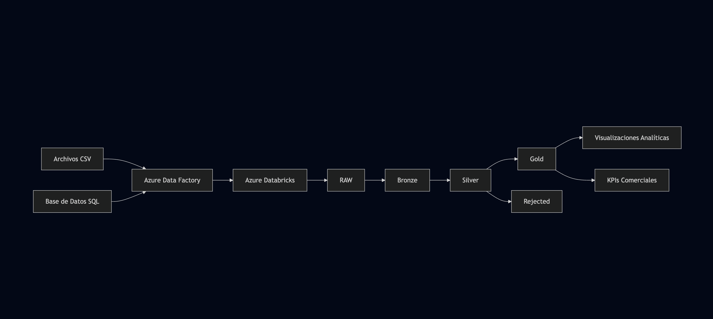
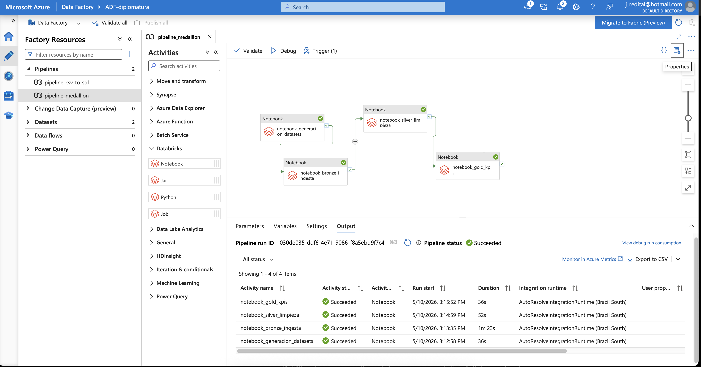
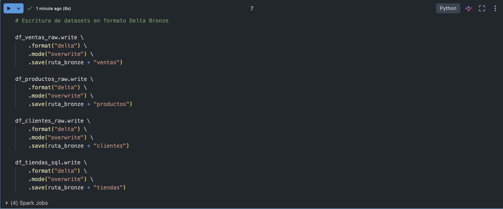
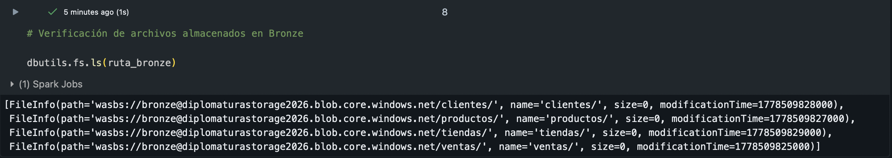
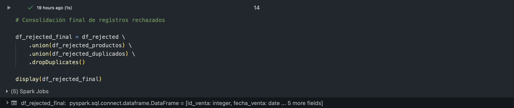
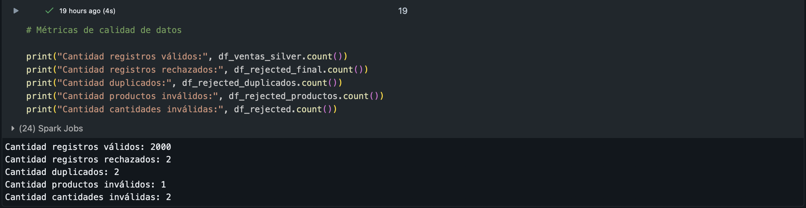
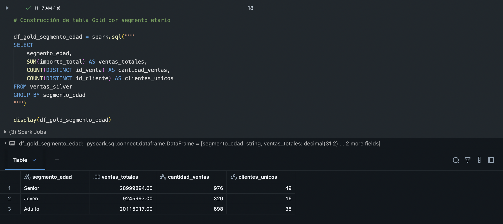
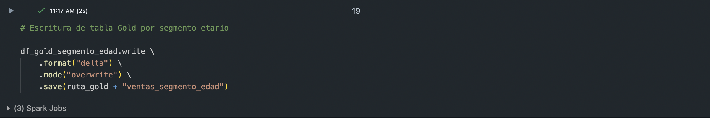
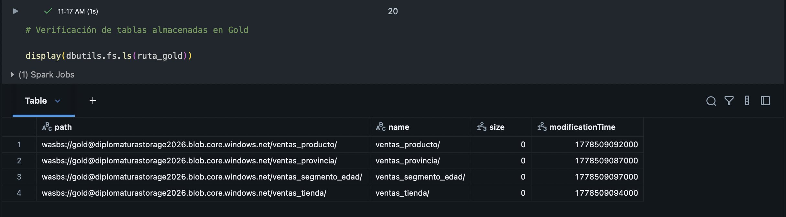
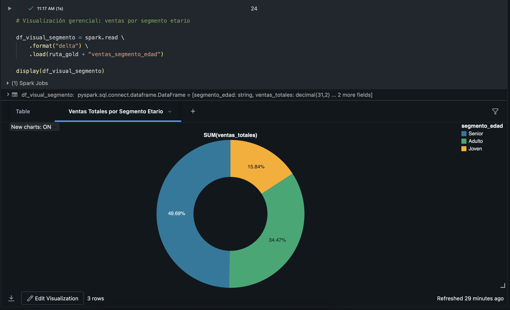

# Pipeline de Datos — Arquitectura Medallion en Azure



## Descripción del proyecto

Este proyecto implementa un pipeline de datos end-to-end utilizando servicios del ecosistema Azure y arquitectura Medallion. La solución permite integrar información proveniente de múltiples fuentes, aplicar procesos de limpieza y validación, enriquecer los datos y generar tablas analíticas orientadas a negocio.

El escenario desarrollado simula un entorno empresarial donde la información se encuentra distribuida entre archivos CSV y una base de datos SQL.

## Tecnologías utilizadas

- **Azure Blob Storage** — almacenamiento de archivos fuente y capas del pipeline
- **Azure Data Factory** — orquestación y automatización del pipeline
- **Azure Databricks** — procesamiento distribuido mediante PySpark
- **Delta Lake** — formato de almacenamiento estructurado
- **PySpark y Spark SQL** — transformaciones y agregaciones analíticas

## Arquitectura

El pipeline implementa una arquitectura Medallion basada en múltiples capas:

| Capa | Descripción |
|------|-------------|
| 🟤 Bronze | Ingesta y almacenamiento inicial |
| ⚪ Silver | Limpieza, validación y enriquecimiento |
| 🔴 Rejected | Almacenamiento de registros inválidos |
| 🟡 Gold | Agregaciones y tablas analíticas |

## Estructura del repositorio

```text
pipeline_medallion_azure/
├── notebooks/
│   ├── 00_Generacion_Datasets.ipynb
│   ├── 01_Bronze_Ingesta.ipynb
│   ├── 02_Silver_Limpieza_Enriquecimiento.ipynb
│   └── 03_Gold_Agregaciones_KPIs.ipynb
├── data/
│   └── sample/
├── docs/
│   ├── documento_funcional.md
│   └── Informe Final.pdf
├── capturas/
├── README.md
```

## Validaciones implementadas

El notebook Silver implementa:

1. Validación de productos existentes
2. Validación de cantidades vendidas
3. Detección de registros duplicados
4. Consolidación de registros rechazados
5. Creación de variables derivadas

Los registros inválidos se almacenan en una capa Rejected para mantener trazabilidad.

## Resultados

### Ejecución completa del pipeline



### Trigger automático


### Notebooks desarrolladas


### Capa Bronze





### Capa Silver






### Capa Gold









## Resultados obtenidos

- Registros válidos: 2000
- Registros rechazados: 2
- Duplicados: 2
- Productos inválidos: 1
- Cantidades inválidas: 2

## Documentación

[Informe Final](docs/Informe%20Final.pdf)

## Cómo configurar el proyecto

1. Clonar repositorio
2. Crear contenedores en Azure Blob Storage
3. Reemplazar:
   - `TU_KEY_AQUI`
   - `TU_USUARIO_AQUI`
   - `TU_PASSWORD_AQUI`

4. Ejecutar notebooks:

- 00_Generacion_Datasets
- 01_Bronze_Ingesta
- 02_Silver_Limpieza_Enriquecimiento
- 03_Gold_Agregaciones_KPIs

## Autor

**Javier Redital**

https://reditaljavier.com
